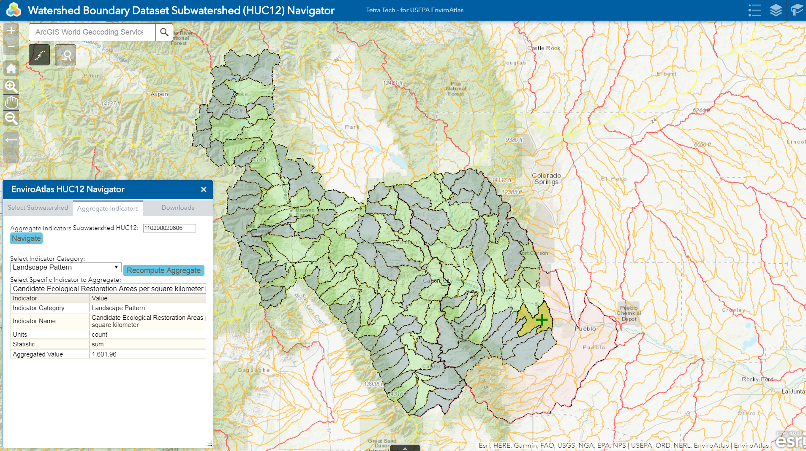

# ESRI Web AppBuilder Custom Widgets
____
This repo contains a customized Web AppBuilder
map/framework, and 1 Web AppBuilder Custom Widget
- [HUC12Nav](https://github.com/JamesBisese/huc12nav/blob/master/widgets/ttHUC12Nav/README.md)

## HUC12Nav :bar_chart: [live demo](https://insdev1.tetratech.com/huc12nav/)
The HUC12Nav is a custom widget to navigate upstream and downstream on the 
Watershed Boundary Dataset (Subwatersheds) and summarize attributes.

### Deploy the app

The entire repo can be deployed in a web server.  It contains all the 
libraries necessary to render the map and run the widget.

The data server used by the widget for navigation IS NOT in this repo -
it is housed in the repo https://github.com/JamesBisese/wbd

Do the following to deploy the app on your server:

1.  Unzip the downloaded app.
2.  Deploy it on your web server.
3.  Browse to the directory where the app from step 2 is locally hosted and open the app **config.json** file.
4.  Add a proxy to your app. Refer to [Use proxy](http://doc.arcgis.com/en/web-appbuilder/manage-apps/use-proxy.htm) for details.  
    _*Important: Make sure that the proxy applied to your app works as expected. The map or widgets might fail if the proxy is set inappropriately._
5.  Add and register the app. Refer to  [Add apps](http://doc.arcgis.com/en/arcgis-online/share-maps/add-items.htm)  and [Register your app](http://doc.arcgis.com/en/arcgis-online/share-maps/add-items.htm#REG_APP) for details.
6.  Copy and paste the AppID to the appId property in the **config.json** file.  
    _Note: Skip step 5 and 6 if the app connects to a web-tire authenticated portal._
7.  Save the **config.json** file.
8.  View the locally hosted app in your browser.

### Customize the app

Use the [Import](https://developers.arcgis.com/web-appbuilder/guide/create-import-app.htm#ESRI_SECTION1_CD827E29515941F490AF21F6F2404E35) function in [Developer Edition](https://developers.arcgis.com/web-appbuilder/) to import the downloaded ZIP file, then customize it in the builder.

Optionally, do the following to customize the application by editing JSON files directly:

*   Add custom widgets
    1.  Put your custom widget in the **widgets** folder.
    2.  Add widget into the app's **config.json**.  
        The example below uses the Demo widget. Add it into the **config.json** file  

        {  
            "uri": "widgets/Demo/Widget"  
        },

*   Configure the app and widgets. Refer to [JSON configuration reference](https://developers.arcgis.com/web-appbuilder/api-reference/app-configuration.htm).
*   Reference preferred ArcGIS API for JavaScript. Refer to [Change URL of ArcGIS API for JavaScript](https://developers.arcgis.com/web-appbuilder/sample-code/change-url-of-arcgis-api-for-javascript.htm).

### Browser requiremets

Supported browsers for deployed applications*:

*   Chrome
*   Firefox
*   Safari 3+
*   Edge
*   Internet Explorer 11\. Internet Explorer 10 and lower is not supported.

*For 3D apps, refer to the [system requirements](https://developers.arcgis.com/javascript/beta/guide/system-requirements/index.html) of ArcGIS API for JavaScript 4.x for details.

### ArcGIS API for JavaScript requiremets

Recommend [the latest version](https://developers.arcgis.com/javascript/jshelp/whats_new.html) of ArcGIS JavaScript API for 2D apps, and [version 4.x](https://developers.arcgis.com/javascript/) for 3D apps.

# Update using GitHub

The application is delivered as a GitHub repository.  This allows sharing
updates based on user input or the chance to add new functionality.

To update

~~~~

james.bisese@DIVS704INSWEB1 C:\inetpub\wwwroot\huc12nav
$ dir
...
11/03/2019  01:42 PM            20,654 3rd-party-license.txt
11/03/2019  01:42 PM               212 appinfo.json
11/03/2019  01:42 PM            15,926 config-readme.txt
11/03/2019  01:42 PM            23,152 config.json
11/03/2019  01:42 PM    <DIR>          configs
11/03/2019  01:42 PM    <DIR>          dynamic-modules
11/03/2019  01:42 PM            11,095 env.js
11/03/2019  01:42 PM    <DIR>          images
11/03/2019  01:42 PM             4,000 index.html
11/03/2019  01:42 PM             7,471 init.js
11/03/2019  01:42 PM    <DIR>          jimu.js
11/03/2019  01:42 PM    <DIR>          libs
11/03/2019  01:42 PM             3,854 readme.html
11/03/2019  01:42 PM             2,752 README.md
11/03/2019  01:42 PM             5,008 simpleLoader.js
11/03/2019  01:42 PM    <DIR>          themes
11/03/2019  01:42 PM               521 web.config
11/03/2019  01:43 PM    <DIR>          widgets

james.bisese@DIVS704INSWEB1 C:\inetpub\wwwroot\huc12nav\widgets\ttHUC12Nav
$ dir Widget.js
11/03/2019  01:41 PM           224,242 Widget.js
...

james.bisese@DIVS704INSWEB1 C:\inetpub\wwwroot\huc12nav
$ git pull
remote: Enumerating objects: 13, done.
remote: Counting objects: 100% (13/13), done.
remote: Compressing objects: 100% (2/2), done.
remote: Total 7 (delta 5), reused 7 (delta 5), pack-reused 0
Unpacking objects: 100% (7/7), done.
From https://github.com/JamesBisese/huc12nav
   71d2227..ffbd3aa  master     -> origin/master
Updating 71d2227..ffbd3aa
Fast-forward
 .gitignore                   |  59 ++++++-
 README.md                    |  35 +++-
 widgets/ttHUC12Nav/Widget.js | 383 +++++++++++++++++++++++++++++--------------  3 files changed, 351 insertions(+), 126 deletions(-)
 ~~~~
After the last update
 ~~~~
james.bisese@DIVS704INSWEB1 C:\inetpub\wwwroot\huc12nav\widgets\ttHUC12Nav
$ dir Widget.js
11/03/2019  05:31 PM           224,271 Widget.js
 ~~~~
if there are no updates
~~~~
james.bisese@DIVS704INSWEB1 C:\inetpub\wwwroot\huc12nav
$ git pull
Already up to date.

~~~~
